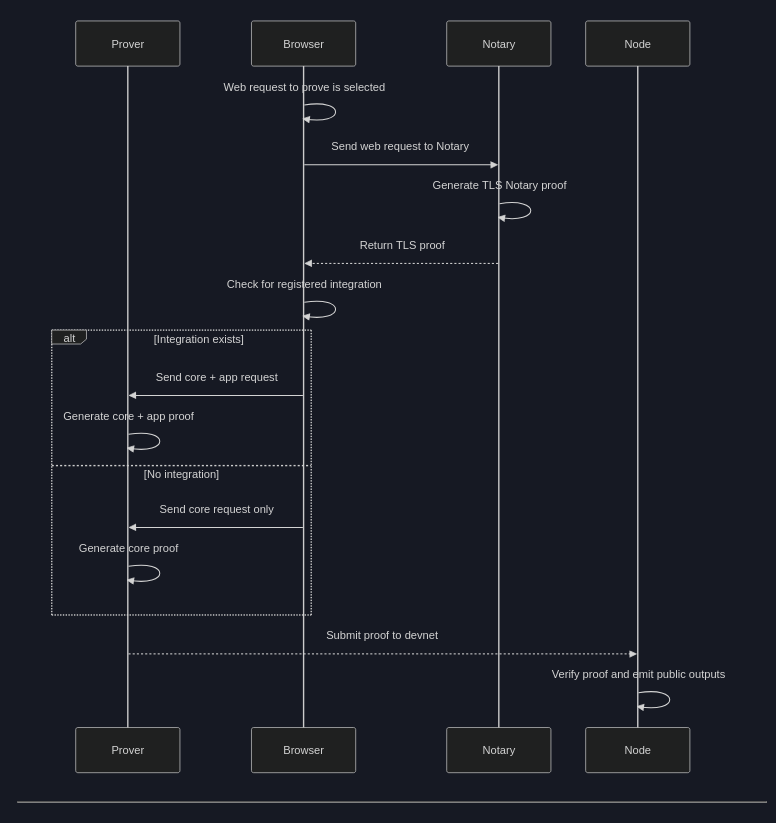

# Generating and Submitting Proofs

This guide walks you through how to generate a proof from a web request and submit it to the Cowboy devnet. It also describes what happens under the hood and how your own programs (integrations) can be proved onchain.

---

## Overview of the Proof Flow



---

## 🔧 What You Need

To generate and submit a proof, you’ll need:

1. ✅ **The Cowboy browser extension**\
   It lets you select web requests to prove, and handles communication with Notary and Prover.

2. ✅ **The Cowboy prover Docker container**\
   This generates zk-STARK proofs using RISC Zero.

Please see the [Resources](./resources.md) page to find the steps to prepare these on your machine.

---

## 🪼 Step-by-Step example: Submitting a Proof

### 1. Install the Cowboy Extension

1. Follow instructions in the [Resources guide](./resources.md) to install and enable the extension in Chrome or Brave.
2. Click the icon for the extension.
3. Click the hamburger icon in the top-right corner > "Options"
4. Under Notary API, enter: "https://juvenile-surface-corps-securities.trycloudflare.com"

This tells your browser how to contact Cowboy's hosted notary server. ⚠️ In general, make sure you're using a trusted notary server.

### 2. Run the Local Prover

You must run the prover container locally:

```bash
docker run -p 1881:1881 --platform linux/amd64 ghcr.io/project-cowboy/cowboy-prover:latest
```

This component must be running in the background to generate and submit proofs.

### 3. Request an X account proof via the extension
1. Click the extension icon to open its menu
2. Click twitter profile.
3. The sidebar should show some steps including browsing to twitter, and collecting cookies. Click them if the UI has not focused those elements.
4. The notarization should be in progress. Wait, and once done, we can explore it.
5. Click "View"

### 4. TLS Notary Proof Is Generated

Once generated, a new window should open, which contains information about the proof. Click the "onchain" tab to progress to a wallet interface.

1. Click the "On-chain" tab
2. You must tell the extension how to reach the node. In the `Node Url` field, enter `wss://goals-unable-seller-myspace.trycloudflare.com`
2. Click "Connect"
3. Click "Create new account". This creates a test account, and stores it in the wallet.
4. Click "Claim" to interact with the onchain faucet account, and claim some funds for your account.
5. Click "Connect and lookup app onchain". This asks the blockchain whether an integration exists for the class of proof you have in your extension. It should show a green success indicator.
6. Click "Prove, and send to network". If the button is not clickable at first, you may need to try again.
7. Wait... this will take a while. Feel free to observe progress in your local prover.

### 6. Proof Is Submitted to the Devnet

The final step above connects with your local prover, which will generate a zk proof that proves a fact about your twitter following.

In the current devnet-only wallet implementation, the extension handles a few steps for you - receiving the proof, and signing a transaction to submit it onchain.

The chain verifies it and may emit public outputs written by the integration logic.

You have just submitted your first zkTLS proof to the Cowboy devnet, and verified it onchain!

---

### 🧬 Recap: What happened?

Above, we just did something very powerful, let's walk through it:

1. We decided we wanted to prove something about our social media profile, and make that available onchain.
2. We used an extension that allows our browser to work with another component, the "notary" to prove the integrity of our web request/response contents.
3. Once we retrieved that proof, we asked our local zk prover to take that proof, as well as the data, and prove some facts about it, in zero-knowledge.
4. The prover first proved the correctness of the proof, before running a different program against that data, to optionally prove a fact about our twitter data, and output a unique credential that we can only receive if authenticated.
5. We received that proof, and wrapped it in a transaction, sent it onchain for it to be verified.
6. Once verified, it emitted an event containing the unique credential from their zkTLS proof!

This showcases some flexibility of the system, and hints at how you might use zkTLS for dApps such as DAOs, or social fi.

## 🧠 What Are Integrations?

Integrations are developer-written programs that define custom logic on top of core proofs. They:

- Accept TLS proof + parsed web data
- Perform custom assertions in Rust
- Output public data to the chain

See [Developer Examples](./example-integrations.md) for templates and inspiration.

---

## 🪨 Writing Your Own Integration (Preview)

Interested in submitting your own logic?

1. Write a Cowboy-compatible Rust program that consumes a TLS Notary proof and parsed web response.
2. Generate the app-specific proof using the prover.
3. Submit to the chain to verify and emit output.

See [Getting Started](./getting-started.md) and [Developer Examples](./example-integrations.md) to dive in.

---

## 🧪 Test the Flow

Use the [live devnet](https://polkadot.js.org/apps/?rpc=wss%3A%2F%2Fallergy-discrimination-croatia-hurricane.trycloudflare.co) to:

- Observe onchain proof submissions
- Monitor emitted public outputs
- Debug issues or verify output formats

---

## ✅ Summary

You now understand:

- How to generate and submit TLS Notary proofs
- The role of the extension, prover, and notary
- What integrations are and how to create your own

🔗 Ready to build? Explore [Developer Examples](./example-integrations.md) or start [Getting Started](./getting-started.md).
